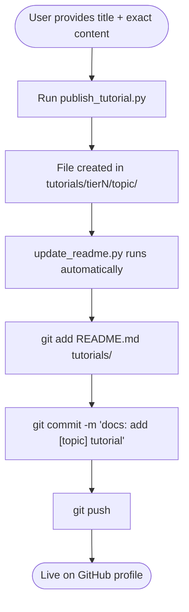
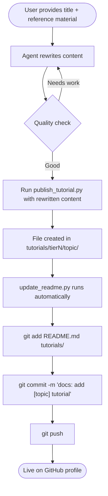

# Publish Tutorial Skill

## When to Use
- User says "add a tutorial", "publish a passage", "create a new article", "write a new tutorial"
- User provides content and wants it filed under a tier/topic
- User provides rough notes or reference material and wants a polished article created

---

## Required Inputs

Always collect these before proceeding:

| Input | Example |
|-------|---------|
| **Title** | `"Rigging Basics in Blender"` |
| **Tier** | `tier1` / `tier2` / `tier3` |
| **Topic** | `blender`, `python`, `unity`, etc. (must match an existing topic folder) |
| **Mode** | *Exact* — use content verbatim · *Reference* — rewrite first |
| **Content** | The actual text or reference material |

---

## Mode A — Exact Content

User provides the finished text to store as-is.



**Run:**
```powershell
python "d:\boycececil666gmailcom\boycececil666gmailcom\.copilot\skills\publish-tutorial\scripts\publish_tutorial.py" `
  --title "Article Title" `
  --tier tier1 `
  --topic blender `
  --content "# Article Title\n\nYour content here."
```

Or pass a file:
```powershell
python "d:\boycececil666gmailcom\boycececil666gmailcom\.copilot\skills\publish-tutorial\scripts\publish_tutorial.py" `
  --title "Article Title" `
  --tier tier1 `
  --topic blender `
  --content-file path\to\draft.md
```

---

## Mode B — Reference Content (Agent Rewrite)

User provides rough notes, a passage from elsewhere, or unstructured reference material.
The agent rewrites it into a clean, well-structured tutorial before saving.



### Rewrite Rules

When rewriting reference content, follow these principles:

1. **Keep all meaning** — do not add, remove, or contradict facts from the source
2. **Improve structure** — use clear `##` / `###` headings to organise sections logically
3. **Improve flow** — write in clear, direct sentences; remove filler words
4. **Use code blocks** where appropriate (` ```language ... ``` `)
5. **Add a brief intro paragraph** summarising what the article covers
6. **Start the file with** `# Article Title` (the exact title the user provided)
7. Do NOT invent examples or facts not present in the reference

### After rewriting

Save the rewritten content to a temporary string, call the script with `--content`, then push:

```powershell
python "d:\boycececil666gmailcom\boycececil666gmailcom\.copilot\skills\publish-tutorial\scripts\publish_tutorial.py" `
  --title "Article Title" `
  --tier tier1 `
  --topic blender `
  --content "<rewritten markdown>"

git add README.md tutorials/
git commit -m "docs: add [topic] tutorial — [title]"
git push
```

---

## Topic → Tier Reference

| Topic folder | Tier |
|---|---|
| `python`, `csharp`, `unity`, `blender`, `photoshop`, `git`, `mcp`, `stable-diffusion` | `tier1` |
| `unreal-engine`, `javascript`, `ros2`, `html`, `godot` | `tier2` |
| `ethereum`, `raspberry-pi`, `stm32` | `tier3` |

---

## Script Location

`d:\boycececil666gmailcom\boycececil666gmailcom\.copilot\skills\publish-tutorial\scripts\publish_tutorial.py`
